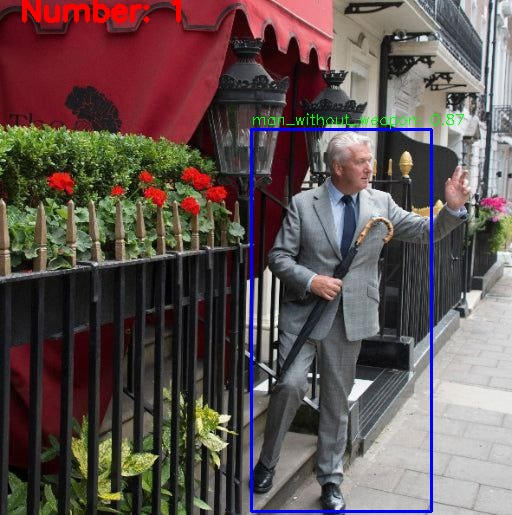

<h1 align="center">Детекция оружия и вооруженных людей</h1>
<h2 align="center">Spect team </h2>

Веб-сервис с возможностью анализа позы человека, детекции наличия оружия и вооруженных людей, а также подсчета степени уверенности в наличии такового на изображении.

Для реализации сервиса мы:
- Собрали данные из открытых источников.
- Разметили изображения, выделили боксы оружия и людей с оружием.
- Написали алгоритмы анализа геометрии и исправили косяки на изображениях.
- Произвели аугментацию (искусственно увеличили количество изображений).
- Обучили модель YoloV8 med.
- Написали фронтенд на React.
- Прикрутили FastApi.
- Создали инструкцию для подключения сторонних камер к нашему сервису.
- Сделали поиск ключевых точек и анализ позы человека.
- Сделали Анализ зашумленности и засвета камеры наблюдения

В веб-сервис встроены машинные исправления различных искажений с видеокамер, а также возможность давать обратную связь по работе модели.
### Структура решения
- Файл `solution.py` основной файл, где идет инициализация моделей.
запуск инференса и форматирование предсказаний, 
- Файл `model.py` содержит код, отвечающий за инференс модели.
- Файл `model_train/Gun_detection.ipynb` содержит код обучения модели.
- Папка `weights` содержит используемые модели.
- Решение собрано в `Docker` контейнер для удобного использования локально.

# Данные

Данные содержат 5 классов:
- Короткоствольное оружие
- Длиноствольное оружие
- Ножи
- Люди без оружия
- Люди с оружием
 
Разметка видео происходила на локальном сервере с помощью сервиса `Label Image`, каждое видео разбивалось на 2 fps. Также использовались открые датасета из roboflow и Kaggle. С учетом аугментации получилось:
 
- 25000 фотографий
- 20000 train 2500 val 2500 test
  
### Аугментация
- Горизонтальный и вертиркальный поворот
- Поворот на +- 17 градусов
- Blur 1.25px

# Обучение модели

Обучили Yolo v8 Medium. Сделали небольшую кроссвалидацию для нахождения наилучших гиперпараметров. Итоговые параметры для обучения:
- 64 Эпохи
- Алгоритм оптимизации AdamW
- Размер батча 64
- Learning rate = 5e-3
- Patience = 8
- Dropout=.1

### Пример работы модели
| Пистолеты                           | Длинноствольное                     | Человек без оружия                          |
| ----------------------------------- | ----------------------------------- | ------------------------------------------- |
|             |        |  |

## Поиск ключевых точек

Поиск ключевых точек реализован с помощью Yolo v8-Pose nano, так как готовая модель отлично подходит для поика точек у людей. Анализ точек происходит с помощью RandomForest.

|Скелет на фото                   | Скелет на видео        |
| --------------------------------| ---------------------- |
|  |  |

